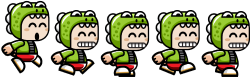

<h1 align="center">Alligator Runner</h1>

> This is an RPG game developed with Phaser library. 
> At this game the main character has to jump through platforms collecting as many coins as possible.
> For each coin collected the player increases his/her score.
> In the end of the game, the user can submit his/her score and a leaderboard is displayed, with the top 6 scores.

### You can access a Live Demo [HERE]()

## Elements

### Main Character - Alligator Boy

### Platforms

### Coins

## Main Scenes

### Menu

> Menu Scene - Where you can navigate through the options: Play, Options, Instructions, and Credits

### Game Scene

> Game Scene - Where the game actually starts. Platforms of different sizes are generated and also random amounts of coins. The user is able to make the character jump through the platforms using the 'SPACE' key or clicking with the left mouse button. Character is allowed to double jump, but no more than two jumps are allowed. Every time the character collects a coin (overlapping the coin) the Score is increased by 10 units and that should be displayed.

### Submit

> Submit Scene - When the character finally falls the "Submit Scene" is generated. Where the user can submit his score. This Scene has a text box where the user should enter with a username. The user should press enter and wait for the submission. 

### Leaderboard

> Leaderboard Scene - After the score submission a leaderboard is displayed and if the last submission is at the top 6, it should be included. This scene contains 2 buttons where the user can choose between play again and come back to the main Menu.

### Instructions

> Instructions - The page contains instructions about how to control the character and also the game goal.

### Credits

> Credits - The scene to acknowledge the developer responsible for the game development.

## Built With

- Javascript
- Webpack
- HTML5
- CSS3
- Jest
- Phaser

## Prerequisites

- Using NPM package and JavaScript knowledge to build and test the game.
- You should install Node.js to run the server with the dependency used. If you don't have Node you can follow this tutorial to set it on your local machine: [HERE](https://www.w3schools.com/nodejs/default.asp)

## Getting Started

To get a local copy of this project running follow these simple steps.

- Clone this repository
 > `git clone <repo>`
- Navigate to the Repo Folder
- To set Webpack and the dependencies run the command
> `npm install`
- Use your favorite browser to open the index.html file (located at the dist page)

- If you have node.js installed and all the dependencies were installed successfully, you can run the following command to start the server where the project will run.

> `yarn start`

- Open the following path using your favorite browser.

> `http://localhost:8000/`

## Running tests

This project contains Built tests using jest. To run the tests on your local machine you can run the following command on the project folder:
 > `yarn test`

 If you want to build customized tests, you should create new files or edit the files inside the tests/ folder.
 The tests files should be always named with the extension .test.js
 To set the watch mode and keep tracking the tests continuously while you build it you can run
> `yarn test-watch`

## Authors

👤 **Marilena Roque**

- Github: [MarilenaRoque](https://github.com/MarilenaRoque)
- Twitter: [@MariRoq88285995](https://twitter.com/MariRoq88285995)
- Linkedin: [roquemarilena](https://www.linkedin.com/in/roquemarilena/)

## 🤝 Contributing

Contributions, issues and feature requests are welcome!

Feel free to check the [issues page](issues/).

## Show your support

Give a ⭐️ if you like this project!